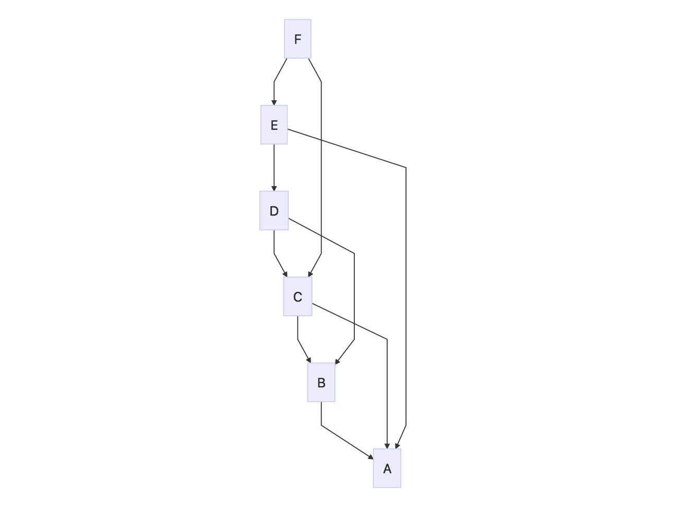

## 背景：
原计划照搬ipfs的gossip网络，经过调研发现它过于复杂不适于目前streamNet场景。在此基础上初步设计了streamnet的gossip网络。

## 需求：
streamnet的网络层需要满足两个条件：
1. 符合gossip网络特征；
2. 能够进行节点同步。

## 业务逻辑
参照下图，每个节点（除初始节点）启动后从指定的节点处获取当前网络，然后选择两个连接数最少的N个节点进行连接；



连接成功后，每隔s秒进行一次心跳检测，每次心跳期间交流信息包含：当前网络状态、当前消息状态：

- **网络状态同步**：
    如果连接节点数少于N则从已从邻居节点处获取网络，选择N-x个节点进行连接。

- **数据同步**：
    - 数据推送：数据写入到节点后进入待发送队列，发送完成进行打标处理。邻居节点接收到数据之后检查parent和reference节点数据是否存在，如果存在则入库并转发；如果不存在则转发并保存到队列，待下次心跳时向邻居节点请求。
    - 数据拉取：节点向邻居节点请求不存在数据，邻居在接收到请求之后检查自己是否存在该数据，如果不存在则保存后向其他邻居节点请求；如果存在则一次性打包该数据M笔数据返回给请求方。

## 数据结构
```
request {
    IWantNode []peer.ID
    IWantNode []Hash      //多个数据原始数据
}

response {
    //存活节点的连接数
    //各节点只更新自己的连接数，如果发现有连接退出则移除本地记录失活节点
    AvailableNetwork map[peer.ID][]int 
    //失活节点被证实数
    //本地证实该节点失活则更新本地信息
    DisavailableNetWork map[peer.ID]int  
    //如果请求没有IWant则不返回
    //如果对方请求genesis数据则返回全部数据
    //如果对方请求数据不存在则向其他邻居节点请求
    IHaveData []interface
}

```

## 接口设计
  ～～进行中～～
