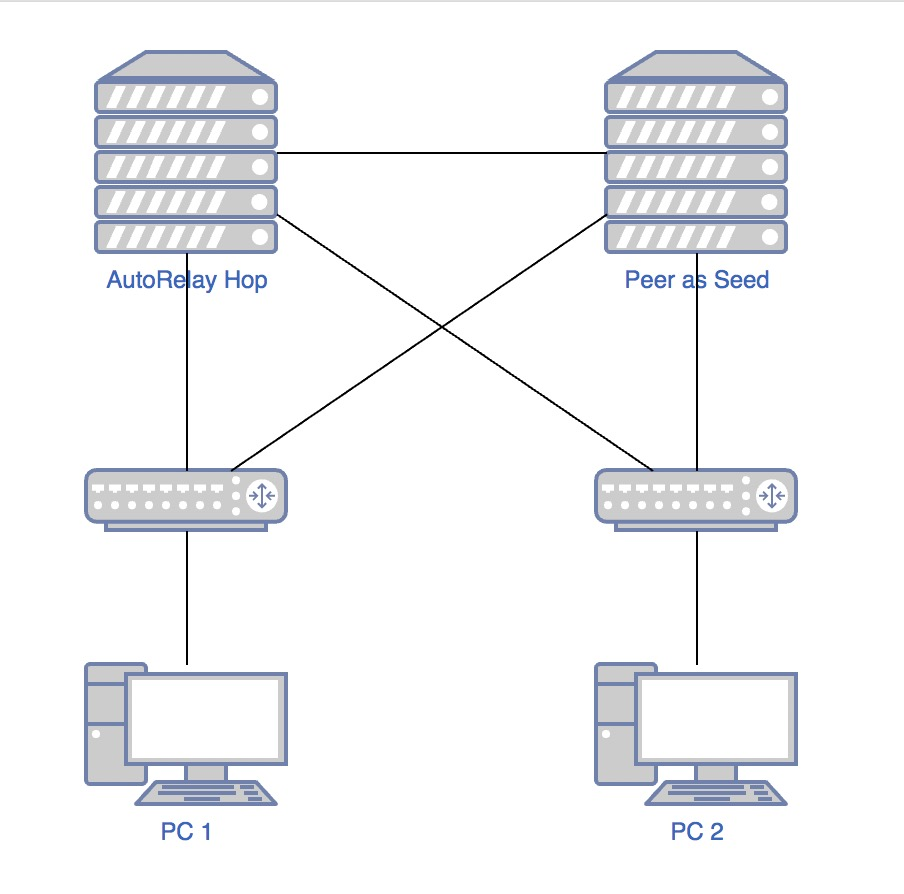
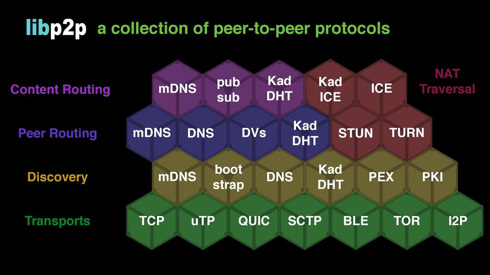

Relay 介绍

1. 实验

   实验目的：验证Libp2p的AutoRelay功能可以使NAT节点建立连接

   实验原理：libp2p的Relay可以让处于NAT的内网节点通过中继建立连接。AutoRelay可以帮助中继自动发布服务地址，需要Relay的节点可以使用中继服务地址组装自己的对外广播地址从而将通过中继建立连接的过程自动化。

   实验准备：

    - 准备两台公网机器（AutoRelay Hop简称Hop 和 Peer As Seed简称Seed）和两台处于不同网段的局域网机器（PC1，PC2），其中 Hop与Seed可以ping通，PC1与Hop和Seed分别可以ping通，PC2与Hop和Seed可以ping通，PC1和PC2不能ping通。其拓扑图如下：

      

      注：如果使用docker请务必确认符合以上网络条件

    - 以上4台机器分别从Github下载并编译测试代码：

      ```
      $ git clone github.com/triasteam/go-streamnet
      $ cd go-streamnet/examples/libp2p/gossipsub-with-relay
      # build it
      $ go build .
      ```

      

   实验步骤：

   - 启动Seed；

   - 启动Hop；
   - 启动PC1、PC2；
   - 等待30秒钟，待日志打印的地址中出现 “circuit” 字样后可以进行下一步操作；
   - 从任意一台机器控制台进行输入，其余三台机器均可以接收到消息；
   - 停止Seed，从PC1控制台发送消息，PC2可以接收到。说明种子只起引导作用，在网络建立起来之后可以随时关停掉；
   - 停止Hop，从PC1（或PC2）控制台发送消息，PC2（或PC1）无法接收到，说明PC1和PC2是通过中继进行通信的，停止中继其通信通道被中断。

2. 原理说明

   - 中继原理说明

     中继是一个传输层协议，通过第三方relay节点在两个无法直接建立通信的节点之间建立连接。比如节点QmA和节点QmB处于不同的局域网中，他们之间不能直接进行通信。但是他们都以连接到公网节点QmR，所以只需要令QmB访问 /ip4/7.7.7.7/tcp/5555/p2p/QmR/p2p-circuit/p2p/QmA就可以与QmA建立通信；同理，QmA访问 /ip4/7.7.7.7/tcp/5555/p2p/QmR/p2p-circuit/p2p/QmB 也可以与QmB建立通信。记得要启动QmR的5555端口，这个最简单的relay实现可以参照demo [relay](https://github.com/triasteam/go-streamnet/tree/master/examples/libp2p/relay)

   - 自动中继原理说明

     自动中继（auto-relay）除了实现基本的relay的功能，还实现了自动发布和实现装配relay的功能。其基本步骤是：

     - Hop节点启动时会启动一个线程，该线会在15分钟后（默认）使用Content Routing服务将消息主题"/libp2p/relay" 广播到邻居节点。因此启动Hop节点必须要配置routing功能。基本流程如下：

     ```
     	// 代码地址：github.com/libp2p/go-libp2p/config/config.go#NewNode
     	// 启动host时执行这里的autorelay逻辑
     	if cfg.EnableAutoRelay {
     		if !cfg.Relay {
     			h.Close()
     			return nil, fmt.Errorf("cannot enable autorelay; relay is not enabled")
     		}
     
     		if router == nil {
     			h.Close()
     			return nil, fmt.Errorf("cannot enable autorelay; no routing for discovery")
     		}
     
     		// AutoRelay 依赖ContentRouting将 /libp2p/relay 消息广播出去
     		crouter, ok := router.(routing.ContentRouting)
     		if !ok {
     			h.Close()
     			return nil, fmt.Errorf("cannot enable autorelay; no suitable routing for discovery")
     		}
     
     		discovery := discovery.NewRoutingDiscovery(crouter)
     
     		hop := false
     		for _, opt := range cfg.RelayOpts {
     			if opt == circuit.OptHop {
     				hop = true
     				break
     			}
     		}
     
     		if hop {
     			// 调用广播逻辑
     			relay.Advertise(ctx, discovery)
     		} else {
     			_ = relay.NewAutoRelay(swrm.Context(), h, discovery, router)
     		}
     	}
     	
     // 代码地址：github.com/libp2p/go-libp2p/p2p/host/relay/relay.go#Advertise
     // Advertise advertises this node as a libp2p relay.
     func Advertise(ctx context.Context, advertise discovery.Advertiser) {
     	fmt.Println("run Advertise goroutine")
     	go func() {
     		select {
     		// AdvertiseBootDelay 默认是15分钟，为了演示效果改为了15秒钟
     		// 注意：发布的代码只会在启动节点时进行一次，如果广播时没有邻居节点则广播失败不会重试。
     		case <-time.After(AdvertiseBootDelay):
     			// RelayRendezvous = “/libp2p/relay”
     			discovery.Advertise(ctx, advertise, RelayRendezvous, discovery.TTL(AdvertiseTTL))
     		case <-ctx.Done():
     		}
     	}()
     }
     ```

     - AutoRelay节点启动时会初始化一个AutoRelay实例，该实例的作用就是使用ContentRouting服务查找发布了“/libp2p/relay”主题的节点，然后把该节点的公网地址（或DNS地址）组装到自己的地址中。当该节点向外同步地址时同步的就是组装后的地址，其格式为 ```/ip4/x.x.x.x/tcp/xxx/p2p/Qm/p2p-circuit```。

       以上查找过程使用```EvtLocalReachabilityChanged```事件触发。

   

   - 种子节点作用

     种子节点与relay没有关系，在使用relay组装的地址手动创建连接时也不需要种子节点（参考[relay demo](https://github.com/triasteam/go-streamnet/tree/master/examples/libp2p/relay)）。但是在自动relay的场景中，由于自动relay依赖ContentRouting进行内容的广播和查找，因此需要种子节点作为引导构建网络。种子节点的作用就是把自己的Addr Book同步给与之建立连接的节点。

   - libp2p的架构图如下，其中种子节点作用于Peer Routing，relay作用于transport，autorelay作用于content routing和transport。

     

   

