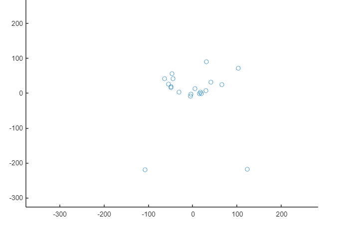
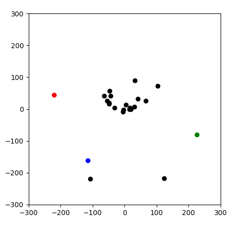
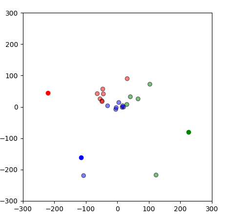
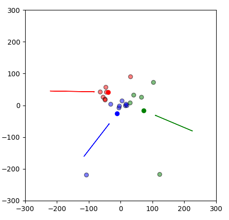
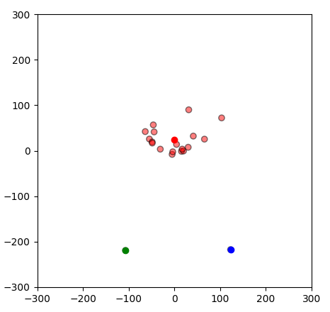

# K-means实验

## 一、准备环境
这里准备了 20 台实际机器，都是云服务器，下面是 IP 列表：

1. 49.*.*.132

2. 49.*.*.238

3. 49.*.*.225

4. 49.*.*.66

5. 154.*.*.178

6. 154.*.*.17

7. 154.*.*.48

8. 140.*.*.20

9. 119.*.*.234

10. 49.*.*.33

11. 170.*.*.40

12. 49.*.*.213

13. 129.*.*.222

14. 150.*.*.31

15. 154.*.*.228

16. 49.*.*.189

17. 45.*.*.240

18. 45.*.*.106

19. 49.*.*.152

20. 49.*.*.248

    

## 二、测试网络延迟
### 1. 测试

使用下面这个脚本来测试网络延迟。

```bash
strings=(
49.*.*.132
...........
)

COUNT=10

for i in "${strings[@]}"; do
    echo "$i"
    re=`ping $i -c $COUNT | grep "time=" | awk '{print $7}' | sed -e "s/^time=//"`
    echo $re|awk '{sum+=$1} END {print "Average = ", sum/NR}' 
    echo
done

```


方法是：每个节点都 ping 所有节点 10 次，然后求得平均值。


得到下面这个表格。

|      | 1     | 2     | 3     | 4     | 5     | 6     | 7     | 8     | 9     | 10    | 11   | 12    | 13    | 14    | 15    | 16    | 17    | 18    | 19    | 20    |
| ---- | ----- | ----- | ----- | ----- | ----- | ----- | ----- | ----- | ----- | ----- | ---- | ----- | ----- | ----- | ----- | ----- | ----- | ----- | ----- | ----- |
| 1    | 0.395 | 0.41  | 0.38  | 0.477 | 0.422 | 2.01  | 1.62  | 1.65  | 77.9  | 0.359 | 227  | 218   | 46.2  | 56.7  | 2.08  | 0.366 | 38.3  | 55.1  | 0.412 | 0.409 |
| 2    | 0.393 | 0.299 | 0.411 | 0.459 | 0.418 | 1.7   | 1.38  | 1.35  | 77.4  | 0.342 | 218  | 170   | 46.3  | 56.3  | 1.33  | 0.392 | 38.6  | 38.5  | 0.429 | 0.343 |
| 3    | 0.371 | 0.385 | 0.322 | 0.46  | 0.425 | 1.9   | 1.67  | 1.66  | 76.7  | 0.361 | 226  | 179   | 45.4  | 42.8  | 1.95  | 0.348 | 41.2  | 53.3  | 0.397 | 0.379 |
| 4    | 0.583 | 0.512 | 0.458 | 0.391 | 0.395 | 1.96  | 1.75  | 1.97  | 78.3  | 0.392 | 226  | 164   | 45.8  | 57.9  | 1.59  | 0.454 | 41.6  | 44.3  | 0.469 | 2.56  |
| 5    | 0.417 | 0.414 | 0.402 | 0.426 | 0.374 | 1.73  | 1.4   | 1.69  | 78.7  | 0.41  | 241  | 200   | 44    | 81    | 1.39  | 0.422 | 53.2  | 50.3  | 0.421 | 0.361 |
| 6    | 2.01  | 1.76  | 1.89  | 2.75  | 1.71  | 0.365 | 0.476 | 0.465 | 78.4  | 1.7   | 252  | 185   | 45.8  | 57.9  | 0.414 | 1.74  | 42.7  | 42.3  | 1.45  | 2     |
| 7    | 1.64  | 1.39  | 1.71  | 1.74  | 1.39  | 0.44  | 0.302 | 0.359 | 80.9  | 1.94  | 230  | 175   | 44.8  | 90.1  | 0.378 | 1.39  | 41.8  | 52.8  | 1.66  | 1.73  |
| 8    | 1.59  | 1.35  | 1.67  | 1.95  | 1.71  | 0.38  | 0.461 | 0.332 | 80.6  | 1.6   | 227  | 173   | 46.1  | 58.1  | 0.328 | 1.4   | 38.8  | 41.9  | 1.36  | 2.04  |
| 9    | 77.9  | 77.3  | 76.6  | 78.4  | 78.7  | 78.4  | 80.9  | 80.6  | 0.301 | 80.5  | 256  | 226   | 33.5  | 66.5  | 77.1  | 78.6  | 36.2  | 38.2  | 79.4  | 79.1  |
| 10   | 0.329 | 0.345 | 0.355 | 0.354 | 0.383 | 1.68  | 1.9   | 1.55  | 80.3  | 0.332 | 228  | 173   | 44.3  | 50.4  | 1.54  | 0.354 | 38.1  | 40.8  | 0.346 | 0.413 |
| 11   | 227   | 218   | 226   | 226   | 239   | 252   | 230   | 227   | 257   | 228   | 0.31 | 90.7  | 220   | 249   | 271   | 224   | 229   | 228   | 219   | 231   |
| 12   | 218   | 170   | 179   | 164   | 241   | 185   | 175   | 173   | 226   | 173   | 90.7 | 0.579 | 199   | 215   | 236   | 179   | 318   | 321   | 214   | 168   |
| 13   | 46.2  | 46.3  | 45.4  | 45.8  | 44    | 45.7  | 44.9  | 46.1  | 33.5  | 44.4  | 220  | 199   | 0.311 | 36.7  | 46.4  | 44.5  | 1.87  | 1.59  | 43.8  | 44.1  |
| 14   | 56.6  | 57.2  | 43.5  | 57.1  | 80.8  | 57.8  | 90.4  | 57.8  | 66.6  | 50.7  | 249  | 215   | 36.7  | 0.287 | 46.6  | 46.3  | 37.5  | 42.6  | 55.8  | 54.4  |
| 15   | 1.64  | 1.35  | 1.92  | 1.86  | 1.37  | 0.436 | 0.331 | 0.388 | 87.4  | 1.55  | 271  | 236   | 46.4  | 46.7  | 0.271 | 1.39  | 52.6  | 52.7  | 1.36  | 1.94  |
| 16   | 0.373 | 0.367 | 0.369 | 0.414 | 0.449 | 1.66  | 1.33  | 1.35  | 78.6  | 0.367 | 224  | 179   | 44.5  | 46.9  | 1.38  | 0.308 | 38.8  | 38.1  | 0.406 | 0.355 |
| 17   | 38.4  | 38.5  | 41.3  | 44.2  | 53.1  | 42.5  | 41.8  | 38.8  | 41.1  | 38.2  | 231  | 322   | 1.99  | 37.5  | 52.7  | 39.3  | 3.8   | 0.522 | 52.8  | 41.3  |
| 18   | 55.2  | 38.7  | 52.1  | 44.6  | 49.2  | 41.8  | 52.6  | 42    | 38.1  | 40.7  | 227  | 321   | 1.77  | 43.4  | 52.8  | 38.1  | 0.482 | 0.336 | 44.5  | 37.9  |
| 19   | 0.424 | 0.407 | 0.412 | 0.449 | 0.428 | 1.44  | 1.61  | 1.37  | 79.8  | 0.387 | 219  | 215   | 43.8  | 56.8  | 1.4   | 0.406 | 52.8  | 44.4  | 0.321 | 0.427 |
| 20   | 0.409 | 0.319 | 0.379 | 0.416 | 0.384 | 1.9   | 1.72  | 2.05  | 79.1  | 0.404 | 231  | 169   | 44    | 93.4  | 1.96  | 0.382 | 41.3  | 37.9  | 0.415 | 0.315 |

**说明**：

- 序号对应于上面列出的 IP 地址
- 测试数据的单位是 ms
- 每一个数据，比如第一行第二列，表示节点 2 ping 节点 1 的时间。
- 

### 2. 处理

分析上面的表格，会发现 2 个问题：

-  一个节点 ping 自己的话，时间长度并不是 0.
- 两个节点 A 和 B， A ping B 与 B ping A 的时间长度可能会不一致


由于 K-means 算法是根据“距离”（distence）来计算的。这里根据K-means算法“距离”的特性，并依据上面具体的数据，进行如下处理：

- K-means中不需要节点到自身的距离，并且从上表中可以看到：节点 ping 自己的时间基本都是零点几毫秒，几乎都是所有数据中最小的。这里就都简化成 0
- K-means中两点之间的距离是唯一的，从上表中也可以看到：基本上 A ping B 的时间与 B ping A 的时间基本差不多，个别的不一样。这里用左下三角来替换右上三角。

得到下表：

|      | 1     | 2     | 3     | 4     | 5     | 6     | 7     | 8     | 9    | 10    | 11   | 12   | 13   | 14   | 15    | 16    | 17    | 18    | 19    | 20    |
| ---- | ----- | ----- | ----- | ----- | ----- | ----- | ----- | ----- | ---- | ----- | ---- | ---- | ---- | ---- | ----- | ----- | ----- | ----- | ----- | ----- |
| 1    | 0     | 0.393 | 0.371 | 0.583 | 0.417 | 2.01  | 1.64  | 1.59  | 77.9 | 0.329 | 227  | 218  | 46.2 | 56.6 | 1.64  | 0.373 | 38.4  | 55.2  | 0.424 | 0.409 |
| 2    | 0.393 | 0     | 0.385 | 0.512 | 0.414 | 1.76  | 1.39  | 1.35  | 77.3 | 0.345 | 218  | 170  | 46.3 | 57.2 | 1.35  | 0.367 | 38.5  | 38.7  | 0.407 | 0.319 |
| 3    | 0.371 | 0.385 | 0     | 0.458 | 0.402 | 1.89  | 1.71  | 1.67  | 76.6 | 0.355 | 226  | 179  | 45.4 | 43.5 | 1.92  | 0.369 | 41.3  | 52.1  | 0.412 | 0.379 |
| 4    | 0.583 | 0.512 | 0.458 | 0     | 0.426 | 2.75  | 1.74  | 1.95  | 78.4 | 0.354 | 226  | 164  | 45.8 | 57.1 | 1.86  | 0.414 | 44.2  | 44.6  | 0.449 | 0.416 |
| 5    | 0.417 | 0.414 | 0.402 | 0.426 | 0     | 1.71  | 1.39  | 1.71  | 78.7 | 0.383 | 239  | 241  | 44   | 80.8 | 1.37  | 0.449 | 53.1  | 49.2  | 0.428 | 0.384 |
| 6    | 2.01  | 1.76  | 1.89  | 2.75  | 1.71  | 0     | 0.44  | 0.38  | 78.4 | 1.68  | 252  | 185  | 45.7 | 57.8 | 0.436 | 1.66  | 42.5  | 41.8  | 1.44  | 1.9   |
| 7    | 1.64  | 1.39  | 1.71  | 1.74  | 1.39  | 0.44  | 0     | 0.461 | 80.9 | 1.9   | 230  | 175  | 44.9 | 90.4 | 0.331 | 1.33  | 41.8  | 52.6  | 1.61  | 1.72  |
| 8    | 1.59  | 1.35  | 1.67  | 1.95  | 1.71  | 0.38  | 0.461 | 0     | 80.6 | 1.55  | 227  | 173  | 46.1 | 57.8 | 0.388 | 1.35  | 38.8  | 42    | 1.37  | 2.05  |
| 9    | 77.9  | 77.3  | 76.6  | 78.4  | 78.7  | 78.4  | 80.9  | 80.6  | 0    | 80.3  | 257  | 226  | 33.5 | 66.6 | 87.4  | 78.6  | 41.1  | 38.1  | 79.8  | 79.1  |
| 10   | 0.329 | 0.345 | 0.355 | 0.354 | 0.383 | 1.68  | 1.9   | 1.55  | 80.3 | 0     | 228  | 173  | 44.4 | 50.7 | 1.55  | 0.367 | 38.2  | 40.7  | 0.387 | 0.404 |
| 11   | 227   | 218   | 226   | 226   | 239   | 252   | 230   | 227   | 257  | 228   | 0    | 90.7 | 220  | 249  | 271   | 224   | 231   | 227   | 219   | 231   |
| 12   | 218   | 170   | 179   | 164   | 241   | 185   | 175   | 173   | 226  | 173   | 90.7 | 0    | 199  | 215  | 236   | 179   | 322   | 321   | 215   | 169   |
| 13   | 46.2  | 46.3  | 45.4  | 45.8  | 44    | 45.7  | 44.9  | 46.1  | 33.5 | 44.4  | 220  | 199  | 0    | 36.7 | 46.4  | 44.5  | 1.99  | 1.77  | 43.8  | 44    |
| 14   | 56.6  | 57.2  | 43.5  | 57.1  | 80.8  | 57.8  | 90.4  | 57.8  | 66.6 | 50.7  | 249  | 215  | 36.7 | 0    | 46.7  | 46.9  | 37.5  | 43.4  | 56.8  | 93.4  |
| 15   | 1.64  | 1.35  | 1.92  | 1.86  | 1.37  | 0.436 | 0.331 | 0.388 | 87.4 | 1.55  | 271  | 236  | 46.4 | 46.7 | 0     | 1.38  | 52.7  | 52.8  | 1.4   | 1.96  |
| 16   | 0.373 | 0.367 | 0.369 | 0.414 | 0.449 | 1.66  | 1.33  | 1.35  | 78.6 | 0.367 | 224  | 179  | 44.5 | 46.9 | 1.38  | 0     | 39.3  | 38.1  | 0.406 | 0.382 |
| 17   | 38.4  | 38.5  | 41.3  | 44.2  | 53.1  | 42.5  | 41.8  | 38.8  | 41.1 | 38.2  | 231  | 322  | 1.99 | 37.5 | 52.7  | 39.3  | 0     | 0.482 | 52.8  | 41.3  |
| 18   | 55.2  | 38.7  | 52.1  | 44.6  | 49.2  | 41.8  | 52.6  | 42    | 38.1 | 40.7  | 227  | 321  | 1.77 | 43.4 | 52.8  | 38.1  | 0.482 | 0     | 44.4  | 37.9  |
| 19   | 0.424 | 0.407 | 0.412 | 0.449 | 0.428 | 1.44  | 1.61  | 1.37  | 79.8 | 0.387 | 219  | 215  | 43.8 | 56.8 | 1.4   | 0.406 | 52.8  | 44.4  | 0     | 0.415 |
| 20   | 0.409 | 0.319 | 0.379 | 0.416 | 0.384 | 1.9   | 1.72  | 2.05  | 79.1 | 0.404 | 231  | 169  | 44   | 93.4 | 1.96  | 0.382 | 41.3  | 37.9  | 0.415 | 0     |


## 三、信用度

### 1. 得到信用度

我们讨论的方案中，需要用到每个节点的信用度。由于目前我们还没有信用度的具体数据，这里我们采用随机分配的方式，来获得 20 个节点的信用值。

方法是通过在这 20 台机器上查看 RANDOM 随机变量来获取随机值。取值范围是 0 ~ 32767。为了跟上面的网络延迟时间相匹配，这里选择取余100 的操作。

```bash
echo $((`echo $RANDOM` % 100))
```

得到下面的列表：

1. 51
2. 53
3. 56
4. 89
5. 79
6. 5
7. 83
8. 2
9. 84
10. 12
11. 72
12. 35
13. 51
14. 14
15. 24
16. 32
17. 72
18. 15
19. 69
20. 14


### 2. 距离的计算

上面得到了每个节点的信用度，但是 K-means 算法中需要使用 distence，是两者之间的一种关系。

这里选择将两个节点信用度的差的绝对值作为一个 distence。

得到下面的矩阵：

|        | Node1 | Node2 | Node3 | Node4 | Node5 | Node6 | Node7 | Node8 | Node9 | Node10 | Node11 | Node12 | Node13 | Node14 | Node15 | Node16 | Node17 | Node18 | Node19 | Node20 |
| ------ | ----- | ----- | ----- | ----- | ----- | ----- | ----- | ----- | ----- | ------ | ------ | ------ | ------ | ------ | ------ | ------ | ------ | ------ | ------ | ------ |
| Node1  | 0     | 2     | 5     | 38    | 28    | 46    | 32    | 49    | 33    | 39     | 21     | 16     | 0      | 37     | 27     | 19     | 21     | 36     | 18     | 37     |
| Node2  | 2     | 0     | 3     | 36    | 26    | 48    | 30    | 51    | 31    | 41     | 19     | 18     | 2      | 39     | 29     | 21     | 19     | 38     | 16     | 39     |
| Node3  | 5     | 3     | 0     | 33    | 23    | 51    | 27    | 54    | 28    | 44     | 16     | 21     | 5      | 42     | 32     | 24     | 16     | 41     | 13     | 42     |
| Node4  | 38    | 36    | 33    | 0     | 10    | 84    | 6     | 87    | 5     | 77     | 17     | 54     | 38     | 75     | 65     | 57     | 17     | 74     | 20     | 75     |
| Node5  | 28    | 26    | 23    | 10    | 0     | 74    | 4     | 77    | 5     | 67     | 7      | 44     | 28     | 65     | 55     | 47     | 7      | 64     | 10     | 65     |
| Node6  | 46    | 48    | 51    | 84    | 74    | 0     | 78    | 3     | 79    | 7      | 67     | 30     | 46     | 9      | 19     | 27     | 67     | 10     | 64     | 9      |
| Node7  | 32    | 30    | 27    | 6     | 4     | 78    | 0     | 81    | 1     | 71     | 11     | 48     | 32     | 69     | 59     | 51     | 11     | 68     | 14     | 69     |
| Node8  | 49    | 51    | 54    | 87    | 77    | 3     | 81    | 0     | 82    | 10     | 70     | 33     | 49     | 12     | 22     | 30     | 70     | 13     | 67     | 12     |
| Node9  | 33    | 31    | 28    | 5     | 5     | 79    | 1     | 82    | 0     | 72     | 12     | 49     | 33     | 70     | 60     | 52     | 12     | 69     | 15     | 70     |
| Node10 | 39    | 41    | 44    | 77    | 67    | 7     | 71    | 10    | 72    | 0      | 60     | 23     | 39     | 2      | 12     | 20     | 60     | 3      | 57     | 2      |
| Node11 | 21    | 19    | 16    | 17    | 7     | 67    | 11    | 70    | 12    | 60     | 0      | 37     | 21     | 58     | 48     | 40     | 0      | 57     | 3      | 58     |
| Node12 | 16    | 18    | 21    | 54    | 44    | 30    | 48    | 33    | 49    | 23     | 37     | 0      | 16     | 21     | 11     | 3      | 37     | 20     | 34     | 21     |
| Node13 | 0     | 2     | 5     | 38    | 28    | 46    | 32    | 49    | 33    | 39     | 21     | 16     | 0      | 37     | 27     | 19     | 21     | 36     | 18     | 37     |
| Node14 | 37    | 39    | 42    | 75    | 65    | 9     | 69    | 12    | 70    | 2      | 58     | 21     | 37     | 0      | 10     | 18     | 58     | 1      | 55     | 0      |
| Node15 | 27    | 29    | 32    | 65    | 55    | 19    | 59    | 22    | 60    | 12     | 48     | 11     | 27     | 10     | 0      | 8      | 48     | 9      | 45     | 10     |
| Node16 | 19    | 21    | 24    | 57    | 47    | 27    | 51    | 30    | 52    | 20     | 40     | 3      | 19     | 18     | 8      | 0      | 40     | 17     | 37     | 18     |
| Node17 | 21    | 19    | 16    | 17    | 7     | 67    | 11    | 70    | 12    | 60     | 0      | 37     | 21     | 58     | 48     | 40     | 0      | 57     | 3      | 58     |
| Node18 | 36    | 38    | 41    | 74    | 64    | 10    | 68    | 13    | 69    | 3      | 57     | 20     | 36     | 1      | 9      | 17     | 57     | 0      | 54     | 1      |
| Node19 | 18    | 16    | 13    | 20    | 10    | 64    | 14    | 67    | 15    | 57     | 3      | 34     | 18     | 55     | 45     | 37     | 3      | 54     | 0      | 55     |
| Node20 | 37    | 39    | 42    | 75    | 65    | 9     | 69    | 12    | 70    | 2      | 58     | 21     | 37     | 0      | 10     | 18     | 58     | 1      | 55     | 0      |


### 3. 计算矩阵

我们暂定的公式是：将网络延迟的矩阵与信用度的矩阵进行线性计算，可以得到我们的 distence 矩阵。

假设 2 个节点之间的网络延迟数据是 x，信用度差值是 y，那么

```
distence = ax + by
```

当 a = 1，b = 1 时，得出的 distence 矩阵如下：

|      | N1     | N2     | N3     | N4     | N5     | N6     | N7     | N8     | N9    | N10    | N11   | N12   | N13   | N14   | N15    | N16    | N17    | N18    | N19    | N20    |
| ---- | ------ | ------ | ------ | ------ | ------ | ------ | ------ | ------ | ----- | ------ | ----- | ----- | ----- | ----- | ------ | ------ | ------ | ------ | ------ | ------ |
| N1   | 0      | 2.393  | 5.371  | 38.583 | 28.417 | 48.01  | 33.64  | 50.59  | 110.9 | 39.329 | 248   | 234   | 46.2  | 93.6  | 28.64  | 19.373 | 59.4   | 91.2   | 18.424 | 37.409 |
| N2   | 2.393  | 0      | 3.385  | 36.512 | 26.414 | 49.76  | 31.39  | 52.35  | 108.3 | 41.345 | 237   | 188   | 48.3  | 96.2  | 30.35  | 21.367 | 57.5   | 76.7   | 16.407 | 39.319 |
| N3   | 5.371  | 3.385  | 0      | 33.458 | 23.402 | 52.89  | 28.71  | 55.67  | 104.6 | 44.355 | 242   | 200   | 50.4  | 85.5  | 33.92  | 24.369 | 57.3   | 93.1   | 13.412 | 42.379 |
| N4   | 38.583 | 36.512 | 33.458 | 0      | 10.426 | 86.75  | 7.74   | 88.95  | 83.4  | 77.354 | 243   | 218   | 83.8  | 132.1 | 66.86  | 57.414 | 61.2   | 118.6  | 20.449 | 75.416 |
| N5   | 28.417 | 26.414 | 23.402 | 10.426 | 0      | 75.71  | 5.39   | 78.71  | 83.7  | 67.383 | 246   | 285   | 72    | 145.8 | 56.37  | 47.449 | 60.1   | 113.2  | 10.428 | 65.384 |
| N6   | 48.01  | 49.76  | 52.89  | 86.75  | 75.71  | 0      | 78.44  | 3.38   | 157.4 | 8.68   | 319   | 215   | 91.7  | 66.8  | 19.436 | 28.66  | 109.5  | 51.8   | 65.44  | 10.9   |
| N7   | 33.64  | 31.39  | 28.71  | 7.74   | 5.39   | 78.44  | 0      | 81.461 | 81.9  | 72.9   | 241   | 223   | 76.9  | 159.4 | 59.331 | 52.33  | 52.8   | 120.6  | 15.61  | 70.72  |
| N8   | 50.59  | 52.35  | 55.67  | 88.95  | 78.71  | 3.38   | 81.461 | 0      | 162.6 | 11.55  | 297   | 206   | 95.1  | 69.8  | 22.388 | 31.35  | 108.8  | 55     | 68.37  | 14.05  |
| N9   | 110.9  | 108.3  | 104.6  | 83.4   | 83.7   | 157.4  | 81.9   | 162.6  | 0     | 152.3  | 269   | 275   | 66.5  | 136.6 | 147.4  | 130.6  | 53.1   | 107.1  | 94.8   | 149.1  |
| N10  | 39.329 | 41.345 | 44.355 | 77.354 | 67.383 | 8.68   | 72.9   | 11.55  | 152.3 | 0      | 288   | 196   | 83.4  | 52.7  | 13.55  | 20.367 | 98.2   | 43.7   | 57.387 | 2.404  |
| N11  | 248    | 237    | 242    | 243    | 246    | 319    | 241    | 297    | 269   | 288    | 0     | 127.7 | 241   | 307   | 319    | 264    | 231    | 284    | 222    | 289    |
| N12  | 234    | 188    | 200    | 218    | 285    | 215    | 223    | 206    | 275   | 196    | 127.7 | 0     | 215   | 236   | 247    | 182    | 359    | 341    | 249    | 190    |
| N13  | 46.2   | 48.3   | 50.4   | 83.8   | 72     | 91.7   | 76.9   | 95.1   | 66.5  | 83.4   | 241   | 215   | 0     | 73.7  | 73.4   | 63.5   | 22.99  | 37.77  | 61.8   | 81     |
| N14  | 93.6   | 96.2   | 85.5   | 132.1  | 145.8  | 66.8   | 159.4  | 69.8   | 136.6 | 52.7   | 307   | 236   | 73.7  | 0     | 56.7   | 64.9   | 95.5   | 44.4   | 111.8  | 93.4   |
| N15  | 28.64  | 30.35  | 33.92  | 66.86  | 56.37  | 19.436 | 59.331 | 22.388 | 147.4 | 13.55  | 319   | 247   | 73.4  | 56.7  | 0      | 9.38   | 100.7  | 61.8   | 46.4   | 11.96  |
| N16  | 19.373 | 21.367 | 24.369 | 57.414 | 47.449 | 28.66  | 52.33  | 31.35  | 130.6 | 20.367 | 264   | 182   | 63.5  | 64.9  | 9.38   | 0      | 79.3   | 55.1   | 37.406 | 18.382 |
| N17  | 59.4   | 57.5   | 57.3   | 61.2   | 60.1   | 109.5  | 52.8   | 108.8  | 53.1  | 98.2   | 231   | 359   | 22.99 | 95.5  | 100.7  | 79.3   | 0      | 57.482 | 55.8   | 99.3   |
| N18  | 91.2   | 76.7   | 93.1   | 118.6  | 113.2  | 51.8   | 120.6  | 55     | 107.1 | 43.7   | 284   | 341   | 37.77 | 44.4  | 61.8   | 55.1   | 57.482 | 0      | 98.4   | 38.9   |
| N19  | 18.424 | 16.407 | 13.412 | 20.449 | 10.428 | 65.44  | 15.61  | 68.37  | 94.8  | 57.387 | 222   | 249   | 61.8  | 111.8 | 46.4   | 37.406 | 55.8   | 98.4   | 0      | 55.415 |
| N20  | 37.409 | 39.319 | 42.379 | 75.416 | 65.384 | 10.9   | 70.72  | 14.05  | 149.1 | 2.404  | 289   | 190   | 81    | 93.4  | 11.96  | 18.382 | 99.3   | 38.9   | 55.415 | 0      |


## 四、可视化

这里试图通过上面得到的距离矩阵，将各个点在二维平面上描绘出来。

采用的是“多维尺度法”（Multidimensional Scaling， MDS)，进行画图。

下面是 Matlab 实现代码

```matlab
clc;
clear all;
close all;

%distance matrix for 20 nodes.
d=[0, 2.393, 5.371, 38.583, 28.417, 48.01, 33.64, 50.59, 110.9, 39.329, 248, 234, 46.2, 93.6, 28.64, 19.373, 59.4, 91.2, 18.424, 37.409;
2.393, 0, 3.385, 36.512, 26.414, 49.76, 31.39, 52.35, 108.3, 41.345, 237, 188, 48.3, 96.2, 30.35, 21.367, 57.5, 76.7, 16.407, 39.319;
5.371, 3.385, 0, 33.458, 23.402, 52.89, 28.71, 55.67, 104.6, 44.355, 242, 200, 50.4, 85.5, 33.92, 24.369, 57.3, 93.1, 13.412, 42.379;
38.583, 36.512, 33.458, 0, 10.426, 86.75, 7.74, 88.95, 83.4, 77.354, 243, 218, 83.8, 132.1, 66.86, 57.414, 61.2, 118.6, 20.449, 75.416;
28.417, 26.414, 23.402, 10.426, 0, 75.71, 5.39, 78.71, 83.7, 67.383, 246, 285, 72, 145.8, 56.37, 47.449, 60.1, 113.2, 10.428, 65.384;
48.01, 49.76, 52.89, 86.75, 75.71, 0, 78.44, 3.38, 157.4, 8.68, 319, 215, 91.7, 66.8, 19.436, 28.66, 109.5, 51.8, 65.44, 10.9;
33.64, 31.39, 28.71, 7.74, 5.39, 78.44, 0, 81.461, 81.9, 72.9, 241, 223, 76.9, 159.4, 59.331, 52.33, 52.8, 120.6, 15.61, 70.72;
50.59, 52.35, 55.67, 88.95, 78.71, 3.38, 81.461, 0, 162.6, 11.55, 297, 206, 95.1, 69.8, 22.388, 31.35, 108.8, 55, 68.37, 14.05;
110.9, 108.3, 104.6, 83.4, 83.7, 157.4, 81.9, 162.6, 0, 152.3, 269, 275, 66.5, 136.6, 147.4, 130.6, 53.1, 107.1, 94.8, 149.1;
39.329, 41.345, 44.355, 77.354, 67.383, 8.68, 72.9, 11.55, 152.3, 0, 288, 196, 83.4, 52.7, 13.55, 20.367, 98.2, 43.7, 57.387, 2.404;
248, 237, 242, 243, 246, 319, 241, 297, 269, 288, 0, 127.7, 241, 307, 319, 264, 231, 284, 222, 289;
234, 188, 200, 218, 285, 215, 223, 206, 275, 196, 127.7, 0, 215, 236, 247, 182, 359, 341, 249, 190;
46.2, 48.3, 50.4, 83.8, 72, 91.7, 76.9, 95.1, 66.5, 83.4, 241, 215, 0, 73.7, 73.4, 63.5, 22.99, 37.77, 61.8, 81;
93.6, 96.2, 85.5, 132.1, 145.8, 66.8, 159.4, 69.8, 136.6, 52.7, 307, 236, 73.7, 0, 56.7, 64.9, 95.5, 44.4, 111.8, 93.4;
28.64, 30.35, 33.92, 66.86, 56.37, 19.436, 59.331, 22.388, 147.4, 13.55, 319, 247, 73.4, 56.7, 0, 9.38, 100.7, 61.8, 46.4, 11.96;
19.373, 21.367, 24.369, 57.414, 47.449, 28.66, 52.33, 31.35, 130.6, 20.367, 264, 182, 63.5, 64.9, 9.38, 0, 79.3, 55.1, 37.406, 18.382;
59.4, 57.5, 57.3, 61.2, 60.1, 109.5, 52.8, 108.8, 53.1, 98.2, 231, 359, 22.99, 95.5, 100.7, 79.3, 0, 57.482, 55.8, 99.3;
91.2, 76.7, 93.1, 118.6, 113.2, 51.8, 120.6, 55, 107.1, 43.7, 284, 341, 37.77, 44.4, 61.8, 55.1, 57.482, 0, 98.4, 38.9;
18.424, 16.407, 13.412, 20.449, 10.428, 65.44, 15.61, 68.37, 94.8, 57.387, 222, 249, 61.8, 111.8, 46.4, 37.406, 55.8, 98.4, 0, 55.415;
37.409, 39.319, 42.379, 75.416, 65.384, 10.9, 70.72, 14.05, 149.1, 2.404, 289, 190, 81, 93.4, 11.96, 18.382, 99.3, 38.9, 55.415, 0;];

n=size(d,1);
t=zeros(n,n);
for i=1:n
    for j=1:n
        t(i,j)=-0.5*(d(i,j)^2 -1/n*d(i,:)*d(i,:)' -1/n*d(:,j)'*d(:,j) +1/n^2*sum(sum(d.^2)));
    end
end
[V,D] = eig(t)
X=V(:,1:2)*D(1:2,1:2).^(1/2);
scatter(-X(:,2),X(:,1));
axis([-300,300,-300,300]);
```


得到下面的图




**这里需要说明的是：并不是所有的二维距离矩阵都能转化成二维图。**


20 个点的坐标是：

| X         | Y         |
| --------- | --------- |
| 4.7102    | 13.8498   |
| -4.919    | -8.1056   |
| -3.5211   | -2.406    |
| 15.5089   | -1.3709   |
| 41.3251   | 32.0813   |
| -63.6863  | 41.9801   |
| 19.8858   | -0.7107   |
| -54.6698  | 25.5969   |
| 65.7593   | 25.3744   |
| -48.6297  | 19.2336   |
| 122.8542  | -217.3484 |
| -106.9949 | -219.186  |
| 17.1332   | 3.3957    |
| -44.3308  | 41.2467   |
| -46.0851  | 56.7392   |
| -30.8095  | 3.3463    |
| 103.2811  | 72.0551   |
| 31.3568   | 89.8609   |
| 30.1838   | 7.5496    |
| -48.3522  | 16.8181   |


## 五、K-means 分组

利用上面的 20 个节点的坐标，以及之前写好的 [python 代码](https://github.com/triasteam/go-streamnet/blob/master/examples/k-means/k-means.py) 。

运行如下：

1. 先将点在图上画出，并指定三个初始质点（红，蓝，绿）

   

2. 第一次分组

   

3. 在组内寻址新的质点

   

4. 再次分组，再次寻找，直到不再变化

   

   
